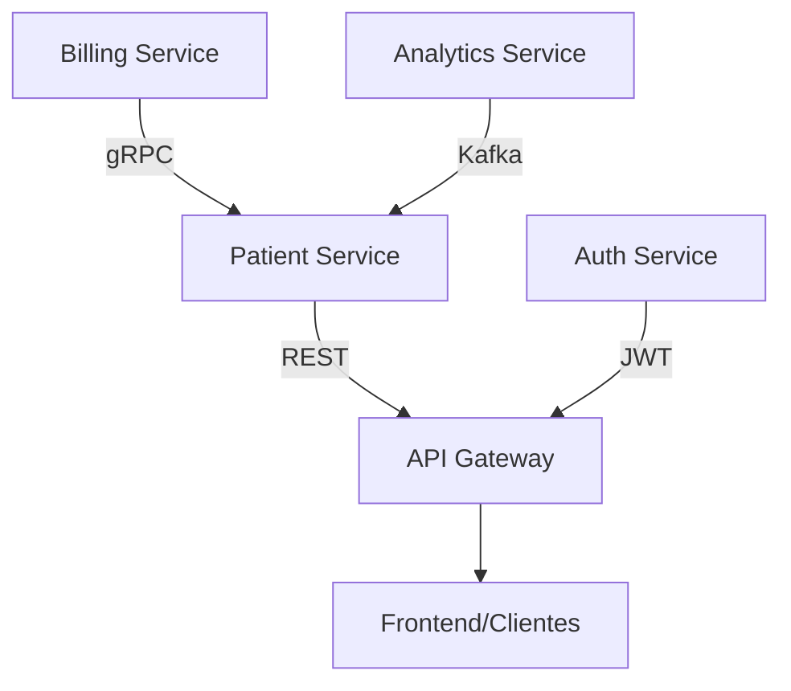

# Patient Management System - Microservices Architecture  

**Autor:** Anuar Avalos Orozco  
**Universidad:** Universidad del Valle de México (UVM)  
**Materia:** Arquitecturas Distribuidas y Microservicios Avanzados  
**Actividad:** Proyecto Final (Actividad 8)  

---

## 📌 Descripción del Proyecto  

Sistema de gestión médica basado en microservicios desarrollado con **Spring Boot 3.x** y **Java 21**, implementando patrones de arquitectura moderna para el manejo eficiente de registros de pacientes.

## 🎯 Objetivos  

| Área | Funcionalidad |
|------|--------------|
| 🏥 Gestión Pacientes | CRUD completo de registros médicos |
| 💳 Facturación | Sistema de cobros mediante gRPC |
| 📊 Analytics | Procesamiento de datos con Kafka |
| 🔐 Seguridad | Autenticación JWT + Spring Security |
| ☁️ Infraestructura | Docker + AWS CloudFormation |

## 🛠️ Stack Tecnológico  


# 🔧 Componentes Principales

## Core Services
- **`patient-service`**: Microservicio principal (Spring Data JPA)
- **`billing-service`**: Facturación (gRPC server)  
- **`analytics-service`**: Procesamiento de datos (Kafka Consumer)

## Infraestructura
- PostgreSQL (Dockerized)  
- Apache Kafka (Event streaming)  
- API Gateway (Spring Cloud Gateway)  

## Seguridad
- Auth Service (JWT generation)  
- Spring Security Config  
- Role-based Access Control  

---

# 📚 Documentación Técnica

```bash
# Endpoints principales
GET /api/patients        # Listar pacientes
POST /api/patients       # Crear nuevo
PUT /api/patients/{id}   # Actualizar
```
## 🚀 Despliegue

```yaml
# Ejemplo docker-compose
services:
  postgres:
    image: postgres:15
    ports:
      - "5432:5432"
```
## 📊 Métricas

| KPI               | Valor Objetivo   |
|-------------------|------------------|
| Tiempo Respuesta  | < 300ms          |
| Disponibilidad    | 99.95% SLA       |
| Throughput        | 1000 req/seg     |

> **Nota académica:** Este proyecto cumple con los requisitos de la actividad 8 de la materia Arquitecturas Distribuidas UVM, demostrando competencia en diseño de sistemas escalables.

**📅 Fecha de entrega:** 14/04/2025
**🖥️ Repositorio:** [github.com/AnuarOrozco/patient-management]([https://github.com/usuario/proyecto](https://github.com/AnuarOrozco/patient-management))
